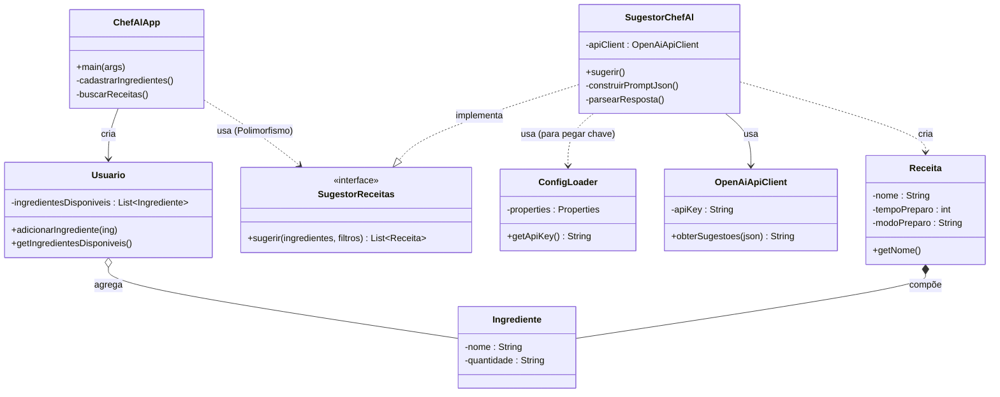

# 👨‍🍳 ChefAl - Sugestor de Receitas Inteligente

O **ChefAl** é uma aplicação Java que utiliza Inteligência Artificial Generativa (OpenAI GPT-4o-mini) para atuar como um assistente culinário. O sistema aplica conceitos sólidos de **Orientação a Objetos** para sugerir receitas baseadas nos ingredientes que o usuário tem em casa.

---

## 🛠️ Configuração e Instalação

### 1. Pré-requisitos
* Java JDK 11 ou superior.
* Uma chave de API da OpenAI (com créditos ativos).

### 2. Configurando a Chave de API (Segurança)
O projeto não contém a chave de API no código-fonte por segurança. Para rodar:
1. Crie um arquivo chamado `config.properties` na raiz do projeto.
2. Adicione sua chave no formato:
   ```properties
   API_KEY=sk-proj-sua-chave-aqui...

### Diagrama de Classes: 

### Exemplo de Uso:
   ### --- Bem-vindo ao ChefAl ---
   1. Cadastrar ingredientes
   2. Buscar Receitas
   3. Sair
```
   > Escolha: 1
   Nome do ingrediente: Ovo
   Quantidade: 2 unidades
   Nome do ingrediente: Queijo
   Quantidade: 100g
   Nome do ingrediente: fim
```
```
   > Escolha: 2
   [ChefAl]: Consultando a inteligência artificial...
```
```   
   --- RECEITAS SUGERIDAS ---
   RECEITA 1: OMELETE DE QUEIJO
      TEMPO: 10 minutos
      INGREDIENTES:
      - Ovo (2 unidades) (Você tem!)
      - Queijo (100g) (Você tem!)
      - Sal (a gosto)
```
```
   MODO DE PREPARO:
   1. Bata os ovos.
   2. Adicione o queijo e o sal.
   3. Frite em fogo médio.
```

